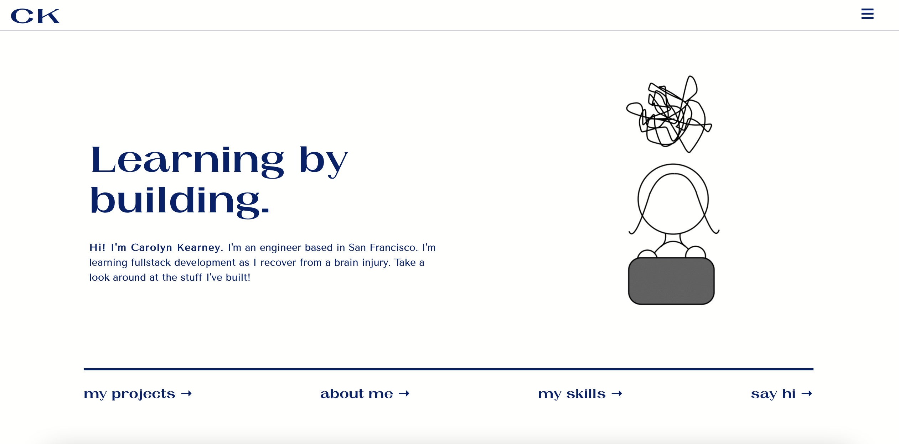

# Portfolio

## Table of contents
* [General information](#general-information)
* [Technologies](#technologies)
* [Setup](#setup)
* [Acknowledgements](#acknowledgements)

## General information
Portfolio website to host my projects, skills, about me, resume, and contact info.   
	
## Technologies
Created with:
* VS Code version 1.58.1
* Git version 2.30.1
	
## Setup
This project can be viewed at [carokrny.github.io/portfolio](carokrny.github.io/portfolio) or [carolynkearney.me](carolynkearney.me). 

## Acknowledgements 
Thank you to [ICONS8](ICONS8.com) for free use of icons for my Skills and Contact section. 

And thank you to [ezgif](ezgif.com) for enabling turning my doodle into a gif. 

Lastly, thank you to [faviconit](faviconit.com) for the free favicon creator. 
